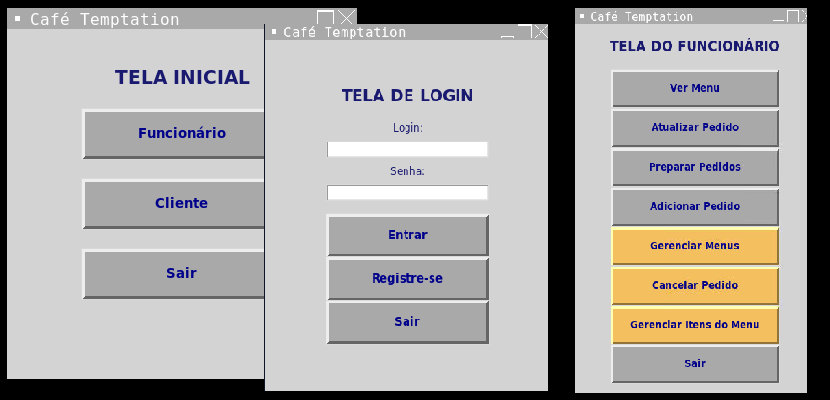

  <h1>Temptation Cafe</h1> 
   
  

 <h2>:test_tube: Link</h2>

 - [Clique para testar o projeto](https://replit.com/@KarenKnup/Projeto-Sistema-do-Cafe-Temptation) **[PORTUGUÊS]**

 - [Click to test the project](https://replit.com/@KarenKnup/Project-Coffee-Temptation) **[ENGLISH]**
 

 <h2>:lock: 'ADMIN' Credentials</h2>
 
**`Login:`** admin
 
**`Password:`** admin123

 
 
 <h2>:pencil: Files</h2>
 
 Name | Function 
---- | --------- 
main.py | Home page, where you choose your route as a customer or employee, and there is no return
cardapio_atual.py | All functions related to the current menu, i.e. the last registered menu
exit.py | Function to exit the system 
`funcoes` funcionario.py | All employee-related functions 
`funcoes` login.py | Path from the `main.py` home screen to the employee or customer screen, plus the path between screens  
tabelas.py | All database tables
altera_cardapio.py | Screen to change the title of a given menu
altera_pedido.py | Screen to change a specific registered order
altera_produto.py | Screen to change a specific product in the current menu
cliente.py | Customer screen, where you can place the order
deleta_cardapio.py | Screen to delete a specific menu
deleta_pedido.py | Screen to delete a specific order
deleta_produto.py | Screen to delete a specific product
exibe_NF.py | Screen followed by `cliente.py`, after clicking on 'Close', for the customer to obtain the invoice
exibe_menu.py | Screen to view the current menu
`paginas` login.py | Login screen on the Employee route screen
`paginas` funcionario.py | Screen with all Employee functionalities
prepare.py | Screen with all pending orders
registra_cardapio.py | Screen for registering a new menu
registra_funcionario.py | New employee registration screen
registra_pedido.py | Screen for registering a new order on the Employee route
registra_produto.py | Screen for registering a new product in the current menu
